# `results/` — Figures and Numerical Summary

All contents of this folder are generated automatically by
`code/PI_CODE.ipynb`. Nothing here should be edited by hand — rerun the
notebook instead, and these files will be overwritten. Both a `.pdf`
(for LaTeX inclusion in the paper) and a `.png` (for previewing, shown
below) are saved for every figure.

## `figures_main/` — Main-text figures

### Figure 1 — Unconstrained region
Proposition 1 (`basic`).

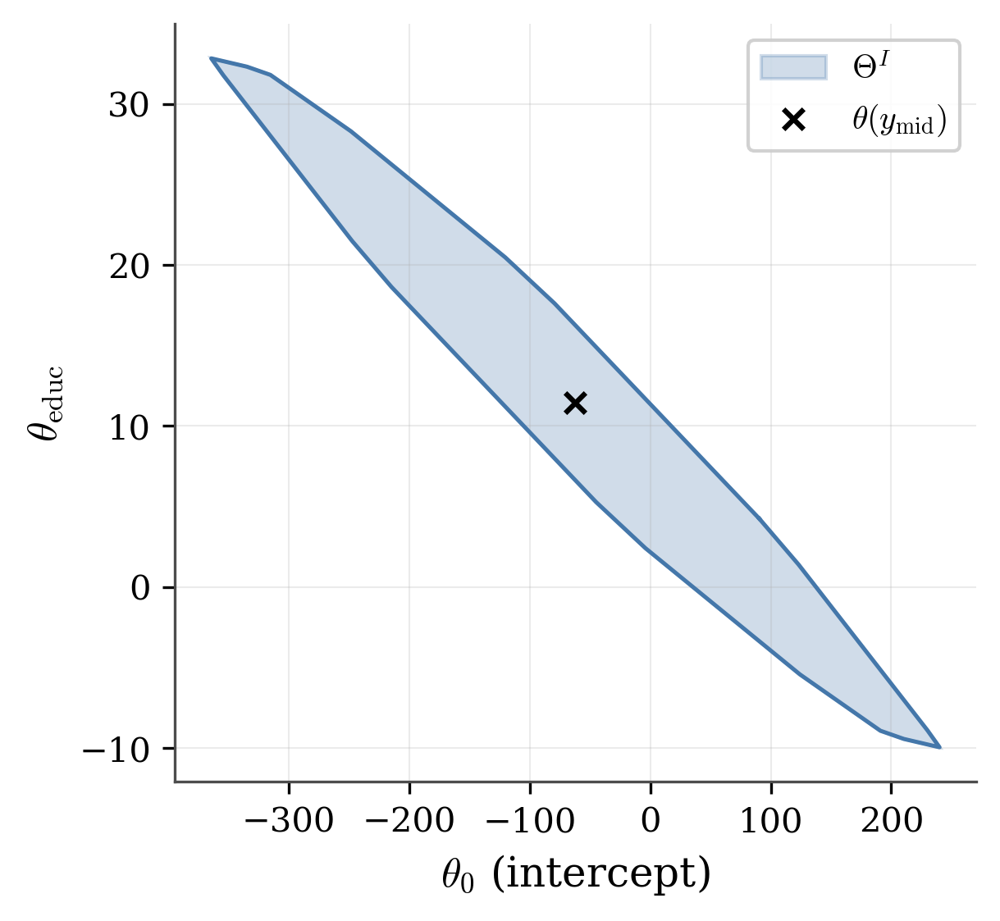

### Figure 2 — Known mean collapses the region to a segment
Proposition 2 (`mean_hyperplane`). $\Theta^I_\kappa$ has area exactly zero.

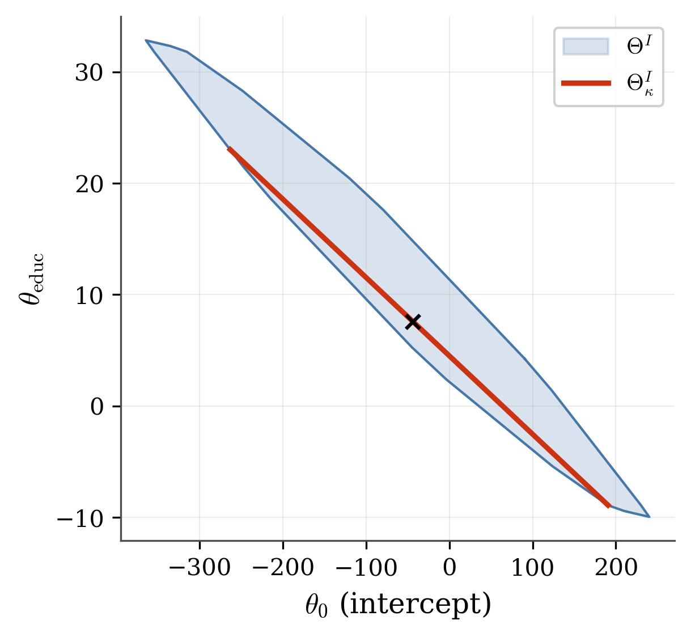

### Figure 3 — Identification with transformations, retargeting to $\theta_f$
Proposition (`transformed_convexity`), Section 2.4. $\Theta^I_f$ and its
mean-restricted segment $\Theta^I_{f\mid\kappa}$.

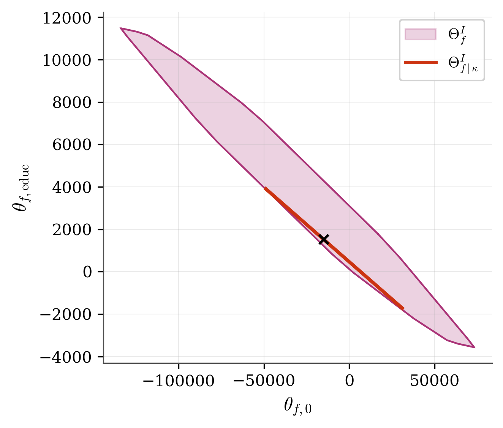

### Figure 4 — Auxiliary moment restriction, no retargeting
Proposition (`moment_aux_convexity`), Section 2.5. A known second
moment alone narrows $\Theta^I$ into a genuine 2-D band, not a segment.

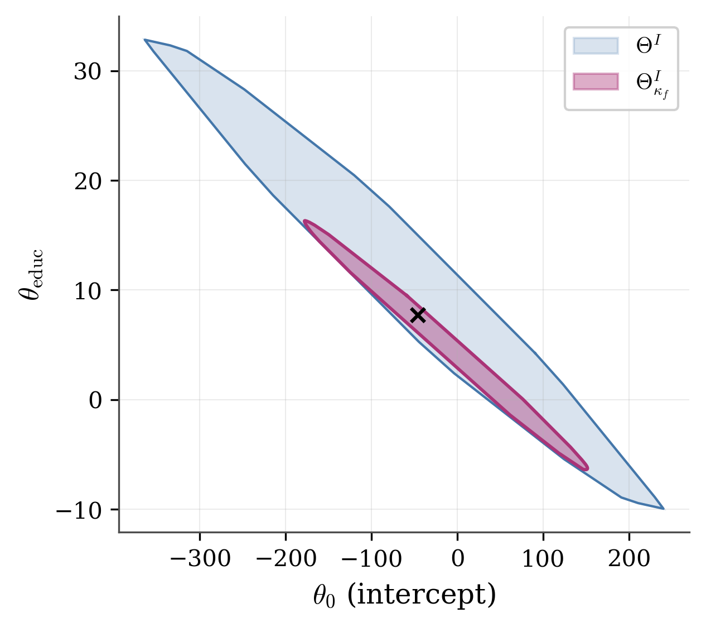

### Figure 5 — Conditioning on race
Proposition (`conditional_fwl`). The return-to-education interval,
unconstrained versus conditional on $\E[y^*\mid\mathrm{race}]$.

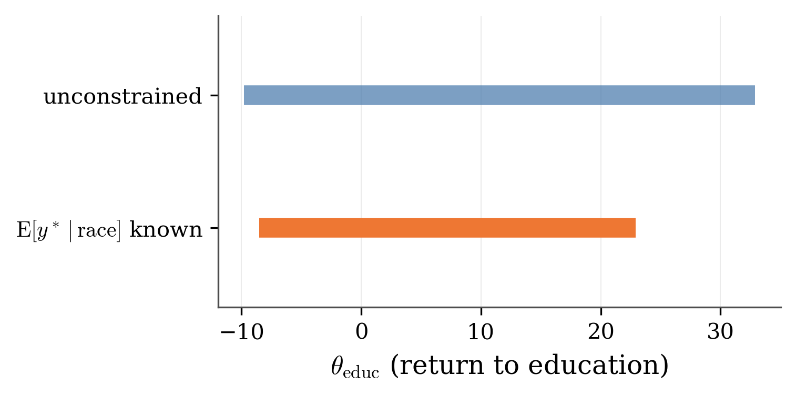

### Figure 6 — Conditioning on an external variable
Propositions (`external_sharp`, `external_contraction`). Return-to-education
interval: unconstrained, pooled mean known, and conditional on age known.

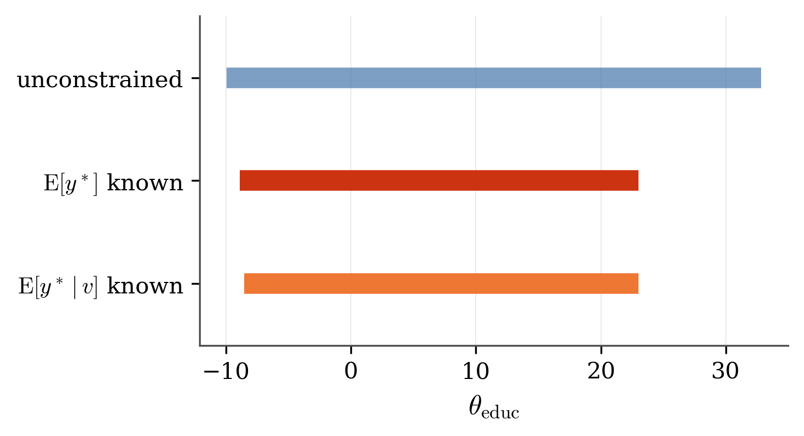

## `figures_appendix/` — Supplementary figures

### Figure B1 — Coordinate bounds
Proposition 3 (`width`).

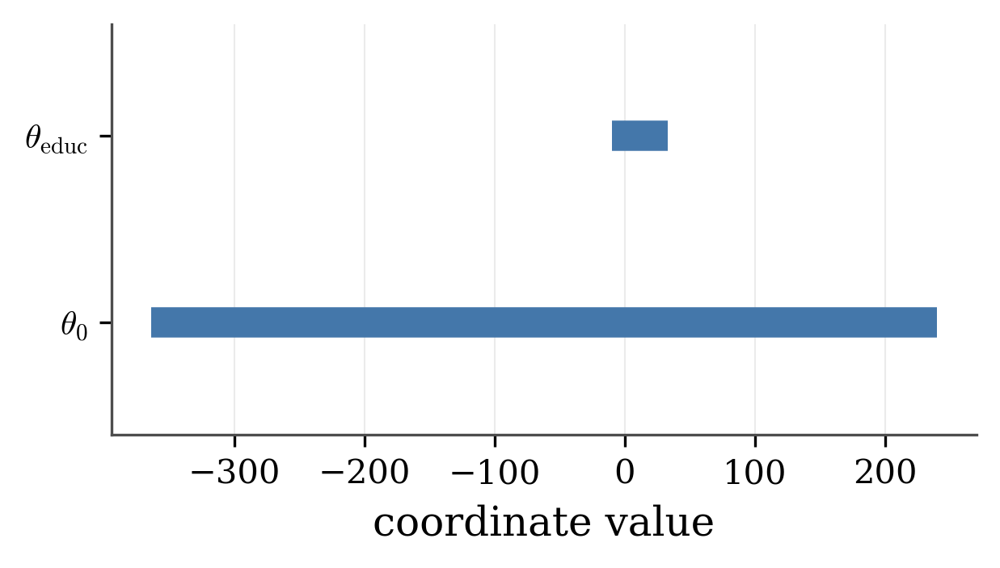

### Figure B2 — Local quadratic contraction check
Corollary (`local_mean_contraction`). Reports an honest negative finding:
the ratio does **not** converge to 1 on this data, because `educ` takes
only 12 distinct values (discrete, not continuous). See `code/README.md`
for the synthetic-continuous cross-check confirming this is a data
property, not a bug.

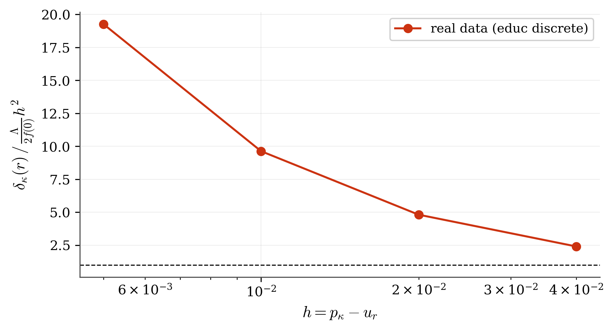

### Figure B3 — Full 3-D region for own-covariate conditioning
Supplementary detail for `conditional_fwl`. The conditional-on-race
segment touches the boundary of the full 3-D $\Theta^I$ exactly (verified
analytically, margin $\approx 10^{-13}$).

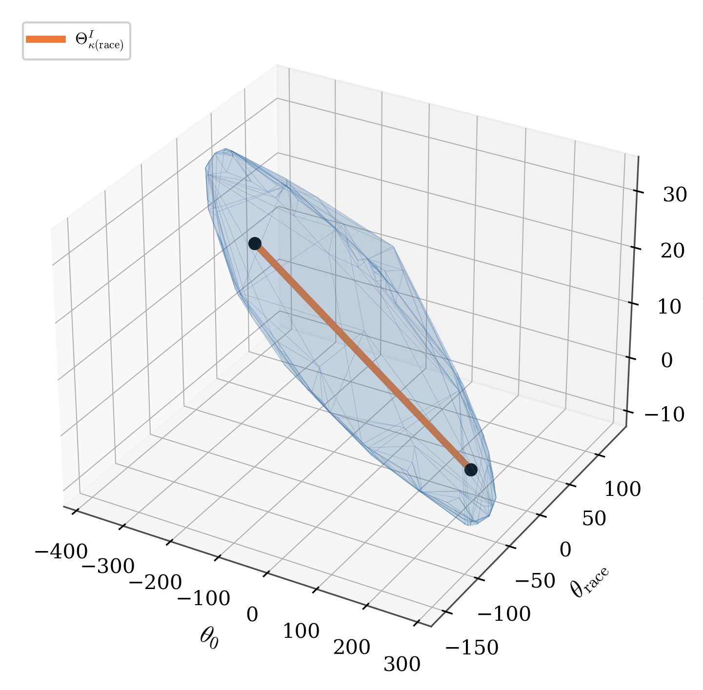

### Figure B4 — Exact 2-D projection of Figure B3
The same tangency need not — and visibly does not — survive projection
to two dimensions; both facts are consistent with the theory.

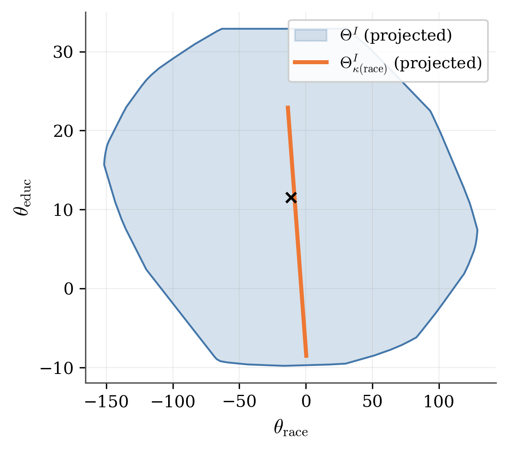

### Figure C1 — Known median (quantile restriction)
Proposition (`appendix_quantile`). $\Theta^I$ versus $\Theta^I_{y\mid f,q}$
under a known median; the ~3.5% shrinkage is small enough that it needs
the zoomed inset to be visible at all.

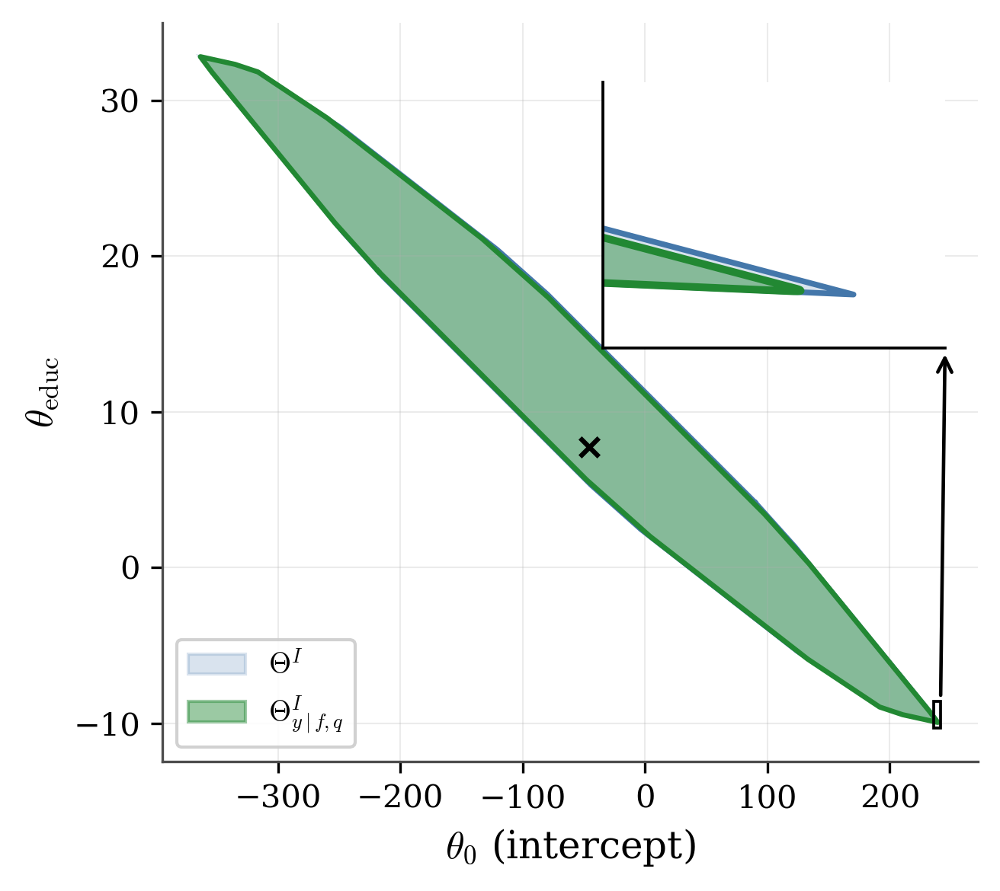

## `results_summary.csv`

Every numerical result computed anywhere in `PI_CODE.ipynb` — areas,
matching checks, contraction values, cutoffs, cross-checks against
generic linear programs — recorded in one place, with columns:

| Column | Meaning |
|---|---|
| `block` | which block of the notebook produced this number |
| `description` | what the number is |
| `value` | the number (or `True`/`False` for a verification check) |

This file is regenerated fresh every time the notebook is run, so it
always reflects the current state of the code rather than a stale
snapshot.
